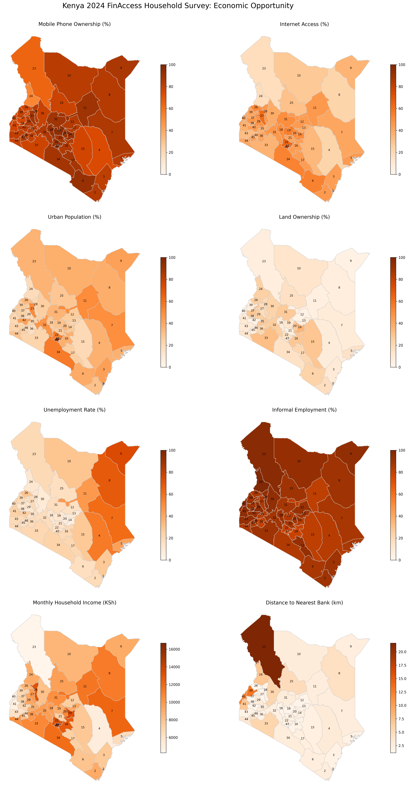
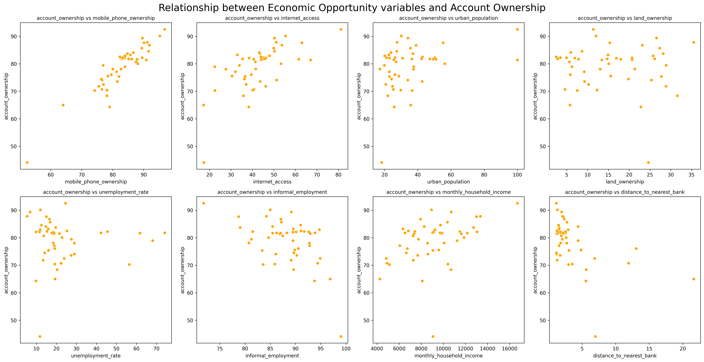
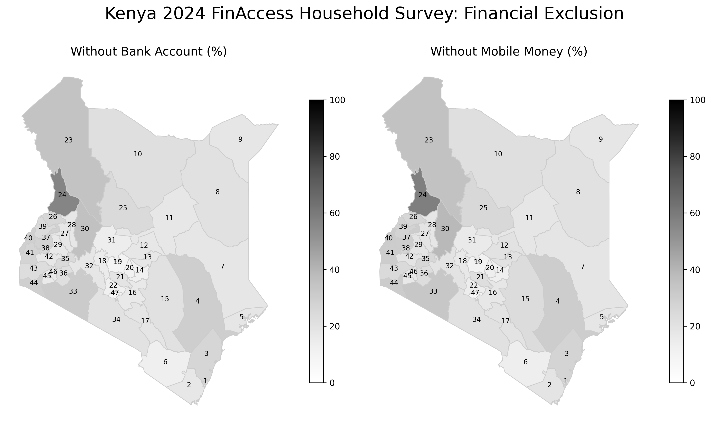
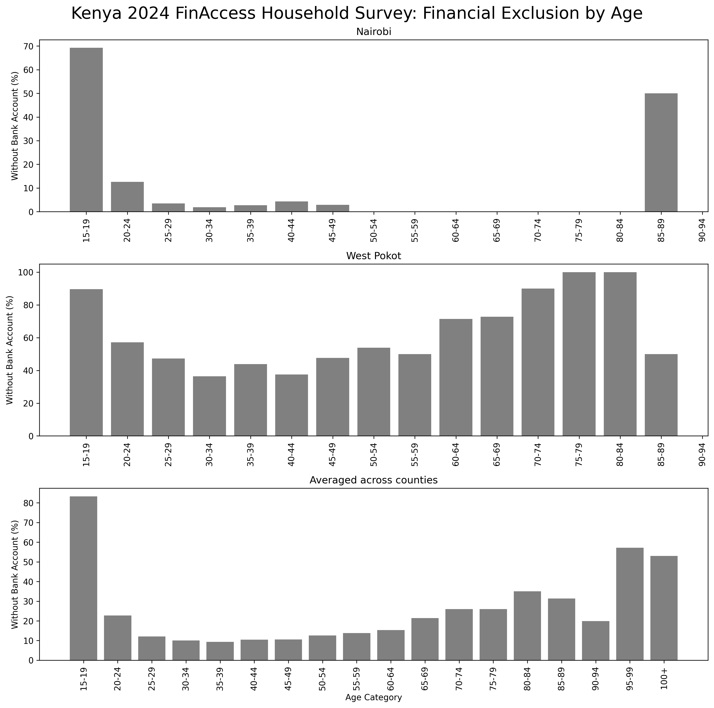

    

# Financial Inclusion & Economic Opportunity - Kenya 🇰🇪
### *DataKind: Insights from the 2024 FinAccess Household Survey*

What are the key factors driving financial inclusion in Kenya today? To find out, I analysed data from 20,871 survey interviews and 🔎 uncovered key insights:

* 🏦 **Financial exclusion remains widespread in Kenya :** Bank account ownership rates vary dramatically, from **92.5%** in Nairobi to just **44.1%** in West Pokot.

* **Youth are especially underserved:** among 15–19 year olds, only **16.7%** have a bank account.

A pathway to Inclusion:
* 📈 Data reveals a **strong correlation** between 📱 mobile phone ownership and access to financial services (mobile money, bank accounts).

* ➡️ This suggests a high-impact, scalable strategy: **expand mobile access** especially in rural areas and among young people.    

Let’s turn data into action. 🎈    

#### 📊 Explore the Jupyter notebook: [GitHub](https://github.com/dpb24/datakind-2025/blob/main/datakind-finaccess-kenya.ipynb)  | [Kaggle](https://www.kaggle.com/code/davidpbriggs/datakind-finaccess-kenya/notebook) | [DataBricks](https://databricks-prod-cloudfront.cloud.databricks.com/public/4027ec902e239c93eaaa8714f173bcfc/2268439070581912/2935149819780672/6259162958285469/latest.html)
 
   

    
    
    
    

