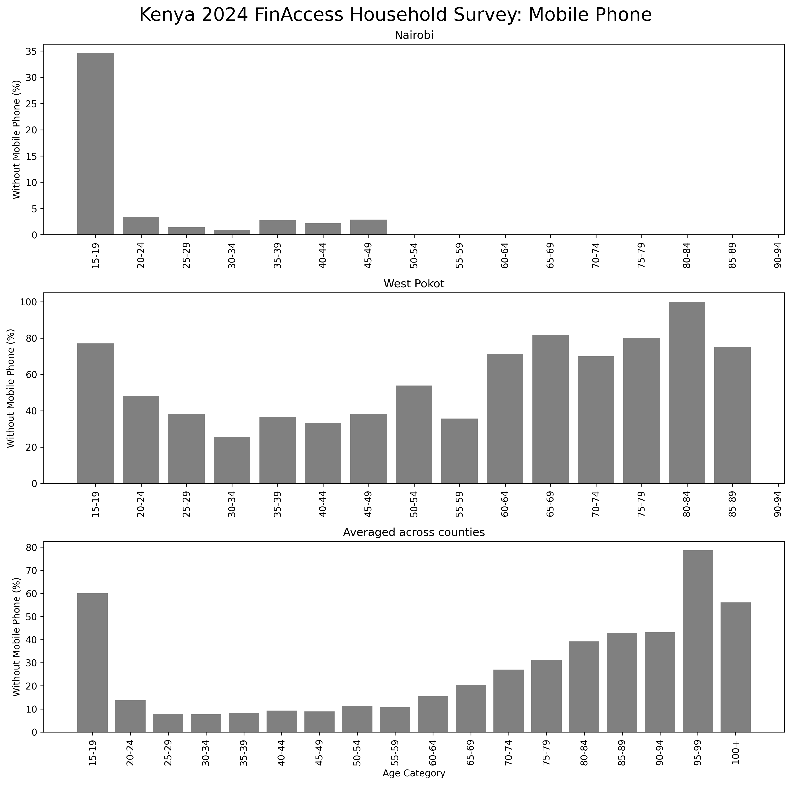

    

# Financial Inclusion & Economic Opportunity - Kenya 🇰🇪

This project presents an Exploratory Data Analysis (EDA) of Kenya’s [2024 FinAccess Household Survey](https://finaccess.knbs.or.ke/reports-and-datasets), conducted for the [DataKind](http://www.datakind.org) event *Exploring International Economic Opportunity Data and Insights*. It explores key drivers of financial inclusion and highlights regional and demographic disparities across the country.

### 🚨 The Challenge 🏧 💵 💳
* **Financial exclusion remains widespread:** Bank account ownership varies dramatically — from **92.5%** in Nairobi to just **44.1%** in West Pokot

* **Youth are especially underserved:** Across counties, an average of **83.3%** of 15–19 year olds across counties lack a bank account

### 💡 A pathway to inclusion 📱
* **Mobile phones are a key enabler:** Strong correlation observed between mobile phone ownership and access to financial services (e.g., bank accounts, mobile money)

* In West Pokot, **47.6%** of adults do not own a mobile phone. **60%** of youths aged 15–19 don't have a mobile phone.   

* **Expanding mobile access** in rural areas and among young people could significantly boost financial inclusion.

#### 📊 Explore the Jupyter notebook [here](https://www.kaggle.com/code/davidpbriggs/datakind-finaccess-kenya/notebook)
 
   

    
    
    
    
    

