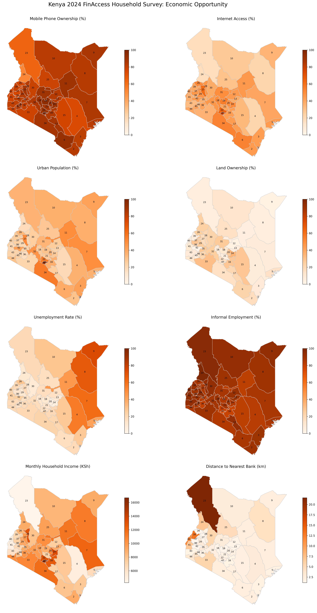
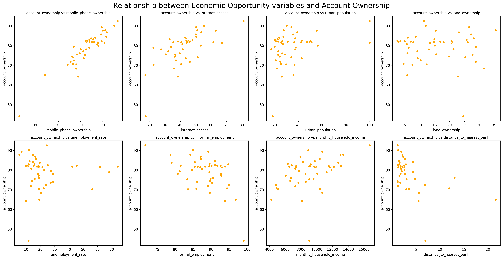
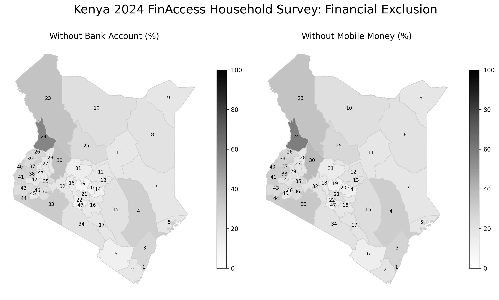
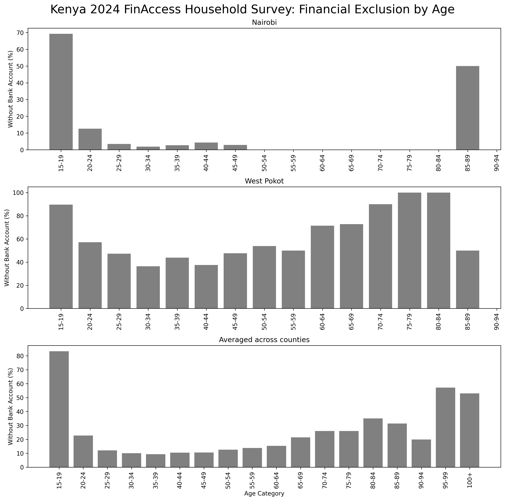

    

# DataKind: Financial Inclusion & Economic Opportunity in Kenya 🇰🇪

**Libraries:** `matplotlib`, `seaborn`, `geopandas`, `pandas`, `numpy`  
**Dataset:** [2024 FinAccess Household Survey](https://finaccess.knbs.or.ke/reports-and-datasets)

What are the key factors driving financial inclusion in Kenya today? To find out, I analysed data from 20,871 interviews from the 2024 FinAccess Household Survey.

🔎 **Key Insights:**
* 🏦 Financial exclusion remains widespread in Kenya
* Bank account ownership rates vary dramatically, from **92.5%** in Nairobi to just **44.1%** in West Pokot
* Youth are especially underserved: only **16.7%** of 15–19 year olds have a bank account

**A pathway to Inclusion:**
* 📈 There is a **strong correlation** between mobile phone ownership and access to financial services
* ⚡ A high-impact, scalable strategy: **expand** mobile access especially in rural areas and among young people    

📖 Jupyter Notebook: [GitHub](https://github.com/dpb24/datakind-2025/blob/main/notebooks/datakind-finaccess-kenya.ipynb)  | [Kaggle](https://www.kaggle.com/code/davidpbriggs/datakind-finaccess-kenya/notebook) | [DataBricks](https://databricks-prod-cloudfront.cloud.databricks.com/public/4027ec902e239c93eaaa8714f173bcfc/2268439070581912/2935149819780672/6259162958285469/latest.html)
 
   

    
    
    
    

